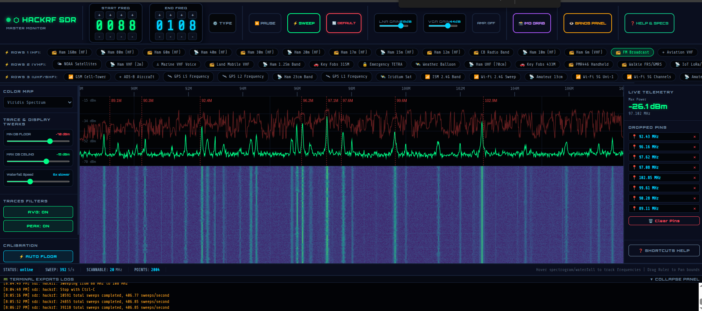

# HackRF SDR Master Console — Sweep Visualizer

<p align="center">
  
  
  
  
  
</p>

A fully standalone, browser-based SDR spectrum analyser and waterfall display for the **HackRF One** (and compatible devices). No SDR# required. No drivers to babysit on every boot. Just run one Python file, open your browser, and watch the RF spectrum live.

When no hardware is connected the tool **automatically falls back to a built-in RF simulator** — realistic noise floor, modulated carriers, FM broadcast peaks, ADS-B, GSM, aviation VHF and more — so you can explore the UI and test everything without touching a radio.

---

## Screenshots



---

## Features

- **Live spectrum analyser** — real-time `hackrf_sweep` FFT data rendered on an HTML5 Canvas
- **Waterfall display** — scrolling time-vs-frequency heat map with selectable colour palettes (Viridis, Plasma, Inferno, Rainbow, and more)
- **Drag-to-pan ruler** — click and drag the frequency ruler to shift the view window
- **Digit-dial frequency selector** — large ±1/10/100/1000 MHz dials for precise band tuning, or switch to direct keyboard entry
- **Quick-band presets** — one-click buttons for FM, Air, Marine, 2m Ham, GSM-900, ADS-B, etc.
- **LNA / VGA gain sliders** — live adjustable 0–40 dB LNA and 0–62 dB VGA, sent to hardware instantly
- **RF preamp toggle** — enables the HackRF's built-in +11 dBm amplifier
- **Bin-width selector** — choose 10 kHz → 1 MHz FFT bin resolution
- **Peak Hold** — freeze the maximum signal envelope across sweeps
- **Averaging** — smooth the spectrum trace over multiple frames
- **Auto-calibrate floor** — one keypress (`A`) sets dBm floor/ceiling from the current noise average
- **Frequency marker pins** — click anywhere on spectrum or waterfall to drop a pin; up to 10 stored
- **Live hover tooltip** — mouse-over shows exact frequency and dBm value plus named signal identification
- **Peak readout** — dedicated display showing the strongest signal frequency and level
- **Uncalibrated label** — a persistent on-screen reminder that dBm readings are relative, not absolute calibrated power levels
- **PNG export** — snapshot the spectrum + waterfall to a timestamped PNG file
- **Built-in console log** — collapsible live log of WebSocket events, hardware errors, and sweep status
- **Keyboard shortcuts** — `Space` pause, `A` auto-calibrate, `R` toggle average, `S` toggle peak hold, `M` clear markers
- **RF Simulator** — offline demo mode with realistically modelled FM, Aviation, Marine, Ham, GSM-900, and ADS-B carriers
- **Graceful hardware management** — kills stale `hackrf_sweep` processes and frees the USB device before each new sweep

---

## How It Works

### Architecture overview

```
┌─────────────────────────────────────────────────────────────┐
│  Browser  (HTML5 Canvas + WebSocket client)                 │
│    ↕  ws://localhost:8085/ws  (full-duplex JSON + CSV)      │
├─────────────────────────────────────────────────────────────┤
│  Flask + flask-sock  (Python web server)                    │
│    ├── /        → serves the single-file HTML console       │
│    └── /ws      → WebSocket handler                         │
│         ├── receives: setSweep JSON commands                │
│         ├── launches: hackrf_sweep subprocess               │
│         ├── streams:  CSV lines → browser                   │
│         └── fallback: RFSimulator when no hardware          │
├─────────────────────────────────────────────────────────────┤
│  hackrf_sweep  (system binary from libhackrf / hackrf-tools)│
│    └── writes CSV to stdout at ~10–50 sweeps/second         │
└─────────────────────────────────────────────────────────────┘
```

### Backend — `hackrf_sweep_visualizer_v1.py`

**Startup sequence**

1. Flask starts on `0.0.0.0:8085`.
2. `free_port()` kills anything already bound to port 8085.
3. `kill_hackrf_users()` terminates any process holding `/dev/hackrf0` (via `lsof`, `fuser`, `killall`).
4. The single HTML page is served from an embedded string — no template files needed.

**WebSocket handler (`/ws`)**

When a browser connects:
- Immediately tries to start `hackrf_sweep -f 88:108 -l 28 -g 44 -w 100000` (FM band at 100 kHz resolution, LNA 28 dB, VGA 44 dB).
- Two daemon threads drain `stdout` (CSV data) and `stderr` (status messages) into bounded `queue.Queue` objects.
- The WS loop checks for incoming JSON commands (`setSweep`), forwards queued CSV lines to the browser (up to 120 per tick), and — if no hardware data has arrived within 2 seconds — switches to `RFSimulator` output.
- On disconnect, `stop_rf()` kills the subprocess and clears the queues.

**`hackrf_sweep` CSV format**

Each line produced by the binary looks like:
```
2025-05-24, 14:32:01.123456, 88000000, 108000000, 100000, 200, -98.2, -97.8, -96.1, ...
```
Fields: `date, time, hz_low, hz_high, bin_width_hz, num_bins, [dBm values…]`

The backend passes these lines verbatim to the browser over the WebSocket.

**`RFSimulator`**

When hardware is absent, the simulator generates synthetic CSV lines using:
- A noise floor derived from the LNA/VGA/amp settings (`noise_center ≈ −102 dBm` at defaults).
- Gaussian-shaped signal peaks centred on real-world carrier frequencies (FM, Aviation VHF, Marine Ch16, 2m ham, GSM-900, ADS-B 1090 MHz).
- Time-varying modulation (`sin(t × modulation_speed)`) so peaks breathe like real signals.

**Process management (Linux/macOS)**

`kill_hackrf_users()` runs three complementary strategies so the USB device is always cleanly released before a new sweep starts:
1. `killall -9 hackrf_sweep hackrf_transfer`
2. `lsof -t /dev/hackrf0` → kill each returned PID
3. `fuser -k /dev/hackrf0`

On Windows it instead runs `taskkill /F /IM hackrf_sweep.exe`.

### Frontend — embedded HTML/JS

The entire UI is a ~1 400-line HTML string embedded inside the Python file (`HTML = r"""..."""`). Flask serves it via `render_template_string`. No static files, no CDN assets (except two Google Fonts).

**Rendering pipeline (per sweep frame)**

1. Browser receives CSV text lines over the WebSocket.
2. Lines are split, parsed, and accumulated into `sweepBins[]` — one Float32Array per complete sweep.
3. When a new sweep starts (detected by `hzLow` wrapping back to the start frequency), three draw calls fire:
   - `drawSpectrum(bins)` — plots a dBm line trace on `specCanvas` with optional peak-hold and averaging overlays.
   - `drawWaterfallLine(bins)` — maps each bin to an RGBA colour via a pre-computed 256-entry LUT, writes one pixel row to `wfCanvas`, then scrolls the existing image down by one row using `drawImage(wfCanvas, 0,0, W,H-1, 0,1, W,H-1)`.
   - `updateSignalMonitor(bins)` — finds the loudest bin and updates the peak-readout display.
4. The frequency ruler is drawn once on resize/range-change onto a third `rulerCanvas`.

**Colour palettes**

`buildLUT(name)` constructs a 256×3 byte lookup table for each scheme. Supported palettes: `viridis`, `plasma`, `inferno`, `magma`, `rainbow`, `hot`, `cool`, `grayscale`.

**Control flow**

- Frequency changes go through `changeFreq(start, end)` which validates the range (minimum 5 MHz span, hardware limits 1–6000 MHz), resets the sweep buffers, redraws the ruler, and calls `sendSweepConfig()`.
- `sendSweepConfig()` sends a `{"cmd":"setSweep", "start":…, "end":…, "lna":…, "vga":…, "amp":…, "binwidth":…}` JSON message to the server, which restarts `hackrf_sweep` with the new parameters.
- Drag-to-pan: `mousedown` on the ruler records `rulerOriginalStart`; `mousemove` computes `mhzPerPx × Δx` shift; `mouseup` commits by calling `sendSweepConfig()`.

---

## Requirements

### Python packages

```
flask>=2.0
flask-sock>=0.6
```

`numpy` is listed in the original header comment but is **not actually imported** in the current version — the simulator uses only `math` and `random`. You do not need to install it.

### System binaries

| Binary | Package | Notes |
|---|---|---|
| `hackrf_sweep` | `hackrf` / `hackrf-tools` | Core SDR sweep command |
| `lsof` | pre-installed on most Linux/macOS | Used to find processes holding the device |
| `fuser` (Linux only) | `psmisc` | Fallback device-freeing tool |
| `killall` (Linux/macOS) | `psmisc` / pre-installed on macOS | Kills stale sweep processes |

---

## Installation

### Linux (Ubuntu / Debian / Raspberry Pi OS)

```bash
# 1. System dependencies
sudo apt update
sudo apt install -y python3 python3-pip hackrf lsof psmisc

# 2. Python dependencies
pip3 install flask flask-sock

# 3. Add yourself to the plugdev group so you can access the HackRF without sudo
sudo usermod -aG plugdev $USER
# Log out and back in, or run: newgrp plugdev

# 4. Clone the repo
git clone https://github.com/sohmee/hackrf_sweep_visualizer_v1.git
cd hackrf_sweep_visualizer_v1

# 5. Run
python3 hackrf_sweep_visualizer_v1.py
```

Open your browser at **http://localhost:8085**

> **Note:** If you get a "permission denied" error accessing the HackRF, either add your user to `plugdev` (above) or run with `sudo python3 hackrf_sweep_visualizer_v1.py` as a temporary workaround.

---

### Linux — Other Distributions

**Arch / Manjaro**
```bash
sudo pacman -S hackrf python-pip lsof psmisc
pip install flask flask-sock
```

**Fedora / RHEL / CentOS**
```bash
sudo dnf install hackrf python3-pip lsof psmisc
pip3 install flask flask-sock
```

**openSUSE**
```bash
sudo zypper install hackrf python3-pip lsof psmisc
pip3 install flask flask-sock
```

In all cases, add yourself to the appropriate USB access group:
```bash
sudo usermod -aG plugdev $USER   # Debian-based
sudo usermod -aG dialout $USER   # Fedora/RHEL-based
```

---

### macOS

#### Option A — Homebrew (recommended)

```bash
# 1. Install Homebrew if you don't have it
/bin/bash -c "$(curl -fsSL https://raw.githubusercontent.com/Homebrew/install/HEAD/install.sh)"

# 2. Install HackRF tools
brew install hackrf

# 3. Install Python (if not already installed)
brew install python

# 4. Python dependencies
pip3 install flask flask-sock

# 5. Clone and run
git clone https://github.com/sohmee/hackrf_sweep_visualizer_v1.git
cd hackrf_sweep_visualizer_v1
python3 hackrf_sweep_visualizer_v1.py
```

Open your browser at **http://localhost:8085**

> On macOS, `lsof` is pre-installed. `fuser` is not available; the tool handles this gracefully and uses the alternatives.

#### Option B — MacPorts

```bash
sudo port install hackrf
pip3 install flask flask-sock
```

---

### Windows

Windows requires a few more steps because HackRF's native driver support is handled through Zadig, and `lsof`/`fuser`/`killall` don't exist. The tool detects Windows (`os.name == 'nt'`) and uses `taskkill` instead — everything else works the same.

#### Step 1 — Install Python

Download Python 3.10+ from [python.org](https://www.python.org/downloads/). During installation, **tick "Add Python to PATH"**.

#### Step 2 — Install HackRF tools for Windows

Download the latest Windows build from the official HackRF releases:
**https://github.com/greatscottgadgets/hackrf/releases**

Look for an asset named `hackrf-YYYY.MM.DD-win.zip` or similar. Extract it and add the `bin/` folder to your system `PATH`:

1. Search for "Environment Variables" in the Start menu.
2. Edit the `Path` variable under "User variables".
3. Add the full path to the extracted `bin/` folder (the one containing `hackrf_sweep.exe`).

#### Step 3 — Install the WinUSB driver with Zadig

HackRF uses a libusb-based driver. On Windows, you need to replace the default driver:

1. Plug in your HackRF One.
2. Download **Zadig** from [zadig.akeo.ie](https://zadig.akeo.ie).
3. Open Zadig → Options → **List All Devices**.
4. Select **HackRF One** from the dropdown.
5. Choose driver: **WinUSB** (do not use libusb-win32 or libusbK for hackrf_sweep).
6. Click **Replace Driver** and wait for it to finish.

#### Step 4 — Install Python dependencies

Open **Command Prompt** or **PowerShell**:
```cmd
pip install flask flask-sock
```

#### Step 5 — Run

```cmd
git clone https://github.com/sohmee/hackrf_sweep_visualizer_v1.git
cd hackrf_sweep_visualizer_v1
python hackrf_sweep_visualizer_v1.py
```

Open your browser at **http://localhost:8085**

> **Firewall prompt:** Windows may ask whether to allow Python network access. Click **Allow** (private networks is sufficient).

---

### Windows — WSL 2 (Windows Subsystem for Linux)

WSL 2 can run the Python server natively, but USB passthrough requires `usbipd-win` to forward the HackRF from the Windows host into the WSL VM.

#### Step 1 — Install WSL 2

```powershell
# In PowerShell (Admin)
wsl --install
# Reboot, then set a username/password for your Linux distro (Ubuntu by default)
```

#### Step 2 — Install usbipd-win (USB passthrough)

Download and install from:
**https://github.com/dorssel/usbipd-win/releases**

Choose the `.msi` installer.

#### Step 3 — Attach the HackRF to WSL

In **PowerShell (Admin)** on Windows:
```powershell
# List USB devices
usbipd list
# Find your HackRF — it will show something like:
# 3-2    1d50:6089  HackRF One

# Bind it (one-time, persists across reboots)
usbipd bind --busid 3-2

# Attach it to WSL
usbipd attach --wsl --busid 3-2
```

You only need to run `attach` each time you plug the device in. The `bind` is permanent.

#### Step 4 — Install dependencies inside WSL

Open your WSL terminal:
```bash
sudo apt update
sudo apt install -y python3 python3-pip hackrf lsof psmisc usbutils
pip3 install flask flask-sock

# Confirm the HackRF is visible
lsusb | grep HackRF
hackrf_info
```

#### Step 5 — Run

```bash
git clone https://github.com/sohmee/hackrf_sweep_visualizer_v1.git
cd hackrf_sweep_visualizer_v1
python3 hackrf_sweep_visualizer_v1.py
```

Open your browser at **http://localhost:8085** — port 8085 on WSL is automatically accessible from the Windows host.

> **Tip:** If you restart your PC, plug the HackRF in and run `usbipd attach --wsl --busid <id>` from a Windows PowerShell admin window before starting the Python server.

---

### SoapySDR / Alternative Drivers

The tool calls `hackrf_sweep` directly as a subprocess — it does **not** use the SoapySDR API. SoapySDR is therefore **not required**.

If you want to use SoapySDR for other purposes alongside this tool, installing it will not cause conflicts. On Linux:
```bash
sudo apt install soapysdr-tools soapysdr-module-hackrf
SoapySDRUtil --find   # confirm HackRF is visible to SoapySDR
```

The HackRF's SoapySDR module and the direct `hackrf_sweep` binary both access the device through `libhackrf`. They cannot run simultaneously — only one process can hold the USB device at a time. This tool's `kill_hackrf_users()` function handles that automatically.

---

## Verifying Your HackRF Works

Before running the visualiser, confirm the hardware is recognised:

```bash
hackrf_info
```

Expected output (abbreviated):
```
Found HackRF
Index: 0
Serial number: 0000000000000000a06063c8234e925f
Board ID Number: 2 (HackRF One)
Firmware Version: 2023.01.1
Part ID Number: 0xa000cb3c 0x00684e62
```

If you see `hackrf_open() failed: HACKRF_ERROR_NOT_FOUND`, check your USB cable, driver installation, and group membership.

---

## Usage Guide

### Frequency controls

| Method | How |
|---|---|
| Digit dials | Click ▲▼ buttons to adjust each digit (1000 / 100 / 10 / 1 MHz steps) |
| Direct type | Click the **TYPE** button to switch to text input boxes |
| Drag ruler | Click and drag the frequency ruler left/right to pan |
| Quick bands | Click preset pills: FM, Air, Marine, 2m, ADS-B, etc. |

### Gain controls (left panel)

| Control | Range | Notes |
|---|---|---|
| LNA Gain | 0–40 dB | Low-noise amplifier — first stage. Higher = more sensitive, more noise. |
| VGA Gain | 0–62 dB | Variable gain amplifier — second stage. Adjust to fill the dBm window. |
| AMP | On / Off | HackRF built-in +11 dBm RF preamp. Use with care — can cause overload. |

### Display controls (right panel)

| Control | Function |
|---|---|
| Min / Max dBm sliders | Set the colour/height mapping range for spectrum and waterfall |
| Waterfall speed | Slows down row rendering (1x = fastest, 8x = slowest) |
| Bin width | FFT bin resolution: 10 kHz (slow, fine) to 1 MHz (fast, coarse) |
| Colour palette | Viridis, Plasma, Inferno, Magma, Rainbow, Hot, Cool, Grayscale |

### Keyboard shortcuts

| Key | Action |
|---|---|
| `Space` | Pause / resume spectrum feed |
| `A` | Auto-calibrate dBm floor from current noise |
| `R` | Toggle trace averaging |
| `S` | Toggle peak hold |
| `M` | Clear all marker pins |

### Markers

Click anywhere on the **spectrum** or **waterfall** canvas to drop a frequency pin. Up to 10 pins are shown in the right panel. Click ✕ to remove individual pins.

### Export

Click **EXPORT PNG** (in the left panel) to save a full-resolution snapshot of the spectrum + waterfall canvas as a timestamped PNG file.

---

## Simulation Mode

If no HackRF is plugged in — or if `hackrf_sweep` fails to start for any reason — the tool automatically activates **simulation mode** after 2 seconds of silence. A status message appears in the console log.

The simulator models these signals:

| Frequency | Signal |
|---|---|
| 88.5 MHz | BBC Radio 2 (FM) |
| 91.3 MHz | Classic FM |
| 95.8 MHz | Capital FM |
| 98.1 MHz | BBC Radio 1 |
| 101.4 MHz | Heart Radio |
| 105.8 MHz | Absolute Radio |
| 120.8 MHz | Tower VHF AM Control |
| 124.55 MHz | Approach Control AM |
| 128.2 MHz | ATIS Weather Broadcast |
| 144.3 MHz | Ham CW Beacon (2m) |
| 145.8 MHz | ISS FM Downlink |
| 156.8 MHz | Marine Channel 16 |
| 935.2 MHz | GSM-900 Cell Tower |
| 1090.0 MHz | ADS-B Mode-S |

Gain and bin-width settings affect the simulated noise floor, so the controls are fully interactive even without hardware.

---

## A note on dBm readings

The dBm values shown on the spectrum display and waterfall are **not calibrated absolute power readings**. They are raw ADC values scaled roughly to dBm based on your current LNA and VGA gain settings. This means if you see -60 dBm on screen, it does not mean the signal at your antenna is truly -60 dBm — it's an estimate that hasn't been corrected against a known reference.

A proper absolute power reading would require feeding in a signal of known power, then offsetting the display to match reality. This would also account for cable loss, antenna characteristics, connector losses, and the HackRF's own gain and noise figure variations across frequency which are not perfectly flat across 1 MHz to 6 GHz.

For this reason the spectrum display shows a persistent **UNCALIBRATED** label. Treat all dBm numbers as relative — useful for comparing signals against each other and spotting what's louder or quieter, but not as a precision power meter. Calibration support is something that may come in a future version.

---

## Troubleshooting

**`hackrf_open() failed: HACKRF_ERROR_NOT_FOUND`**
- Check the USB cable — HackRF requires USB 2.0 or 3.0 data cable, not a charge-only cable.
- Linux: run `sudo usermod -aG plugdev $USER` then log out and back in.
- Windows: re-run Zadig and confirm WinUSB is selected.
- WSL: confirm `usbipd attach` was run after plugging in.

**`address already in use` on port 8085**
- The tool calls `free_port(8085)` on startup to kill whatever is using the port. If that fails, find and kill it manually: `lsof -ti :8085 | xargs kill -9`

**Waterfall is blank / spectrum shows only noise**
- Try increasing LNA and VGA gain.
- Press `A` to auto-calibrate the dBm floor.
- Make sure an antenna is connected.

**Simulation mode activates even though hardware is plugged in**
- Run `hackrf_info` in a terminal to confirm the device is accessible.
- Check that no other SDR application (SDR#, GQRX, SoapySDR) is holding the device.

**Very slow or choppy waterfall**
- Increase the bin width (lower resolution = faster sweeps).
- Reduce the scan range (narrower frequency span = faster sweeps).
- Increase the waterfall speed slider.

**Port 8085 blocked by firewall (WSL or remote access)**
- The server binds to `0.0.0.0`, so it's reachable from other machines on the LAN. Make sure your firewall allows TCP 8085 if you want remote access.

---

## Frequency Range

The HackRF One covers **1 MHz – 6 GHz**. The tool enforces these hardware limits on all frequency inputs. Some regions of the spectrum (e.g. below 30 MHz) may show elevated noise due to the HackRF's architecture — this is normal.

---

## License

MIT — do whatever you want, keep the credit.

---

## Author

**sohmee** — [github.com/sohmee](https://github.com/sohmee)

---

## Acknowledgements

- [Great Scott Gadgets](https://greatscottgadgets.com/hackrf/) — HackRF hardware and `hackrf_sweep` tool
- [Flask](https://flask.palletsprojects.com/) + [flask-sock](https://github.com/miguelgrinberg/flask-sock) — Python web server
- [Orbitron](https://fonts.google.com/specimen/Orbitron) + [Share Tech Mono](https://fonts.google.com/specimen/Share+Tech+Mono) — UI fonts
